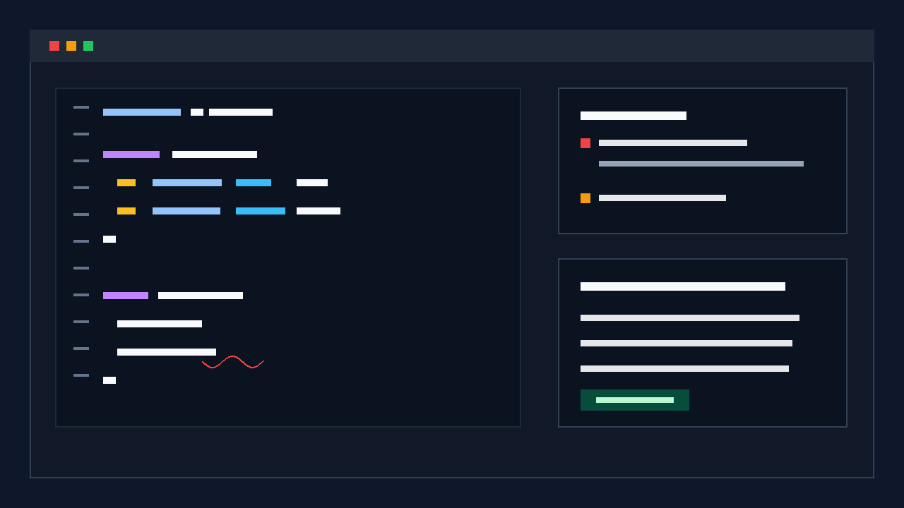

# Thrift Support for VSCode

[English](./README.md) | [简体中文](./README.zh-CN.md)

Apache Thrift language intelligence for VS Code: syntax highlighting, formatter, diagnostics, navigation, completion, rename/refactor, a CI-ready CLI, and performance gates.

[](https://marketplace.visualstudio.com/items?itemName=tanzz.thrift-support)
[](https://marketplace.visualstudio.com/items?itemName=tanzz.thrift-support)
[](https://open-vsx.org/extension/tanzz/thrift-support)
[](https://open-vsx.org/extension/tanzz/thrift-support)
[](https://github.com/tzzs/vsce-thrift-support/actions/workflows/ci.yml)
[](https://github.com/tzzs/vsce-thrift-support/actions/workflows/publish.yml)



> For development details, see [DEVELOPMENT.md](DEVELOPMENT.md).
> For configuration keys, see [docs/settings-reference.md](docs/settings-reference.md). For supported versions and vulnerability reporting, see [SECURITY.md](SECURITY.md).

## 🚀 Features

### Syntax Highlighting

- Full Thrift syntax coverage: keywords, data types, strings, comments, numeric literals
- Supports all primitive and container types (including `uuid`)
- Smart token coloring for better readability

### Code Formatting

- Document formatting: format the entire Thrift file with one command
- Selection formatting: format only the selected text
- Smart alignment: align field types, field names, and comments
- Configurable: indentation, line length, and more formatting rules

> Publisher namespace: tanzz (used for both VS Marketplace and Open VSX)

### Code Navigation

- Go to Definition: jump to type definitions quickly
- Include resolution: follow `include` statements across files
- Workspace search: find definitions across the workspace

### Editor Semantic Features

- Semantic Tokens: AST-based full-document VS Code Semantic Tokens for types, fields, enums, services, methods, constants, and related symbols. Incremental semantic token edits are not implemented.
- Call Hierarchy: incoming/outgoing calls for service and interaction methods.
- Type Hierarchy: full service `extends` chains, typedef alias chains, and top-level items for struct/union/enum/exception/interaction. Standard Thrift IDL does not support struct/exception inheritance, so non-standard `struct ... extends ...` input is not documented as an inheritance relationship.

### Code Refactoring

- Identifier rename (F2): updates references across files with basic conflict checks
- Extract type (typedef): infer type from selection or current field and generate a `typedef`
- Move type to file: move `struct/enum/service/typedef` into a new `.thrift` file and auto-insert an `include`

### Advanced Features

- **Stream**: supports experimental stream syntax
- **Sink**: supports experimental sink syntax
- **Interaction**: supports experimental interaction syntax

## ⚡ Performance

- **Incremental parsing**: only re-parses affected blocks on edit; cache hits respond in <5ms
- **Smart caching**: LRU-K multi-tier cache with memory-pressure eviction, covering AST, diagnostics, definitions, symbols, and more
- **Concurrent analysis**: up to 3 files analysed simultaneously (3× improvement over earlier versions), with debounce/throttle to prevent UI jank
- **Large-file support**: files >10 000 lines are split at top-level block boundaries for formatting, avoiding O(n²) alignment scans
- **CI performance gate**: built-in benchmarks enforce <500ms parse and <500ms format for 1000-line files; failures block CI

See [PERFORMANCE.md](PERFORMANCE.md) for tuning tips and CI integration details.

## 📖 Advanced Feature Docs

See [advanced features](docs/advanced-features.md) for details about stream, sink, interaction, and other experimental syntax.

## 🔐 Trust and Release Posture

- MIT licensed, free extension published under the `tanzz` namespace on Visual Studio Marketplace and Open VSX.
- No telemetry or analytics collection is implemented in the current source.
- Release automation uses release-please; a published GitHub Release triggers VSIX packaging, Visual Studio Marketplace publishing, Open VSX publishing, and npm CLI publishing.
- CI gates cover lint, build, test, coverage, CLI dogfood, package smoke, and performance assertions.
- See [docs/release-verification.md](docs/release-verification.md) and [SECURITY.md](SECURITY.md) for the current verification and security model.

## 🖥️ CLI Tool

In addition to the VS Code extension, a standalone npm CLI tool `thrift-support` is available for use in CI/CD pipelines or the command line.

### Install

```bash
npm install -g thrift-support
# or install locally in your project
npm install --save-dev thrift-support
```

### Commands

```bash
# Check formatting (recommended for CI)
thrift-support format --check src/**/*.thrift

# Format and write back to files
thrift-support format --write src/

# Read from stdin and output to stdout
echo "struct Foo{1:i32 id}" | thrift-support format --stdin

# Run diagnostics (syntax + semantic rules)
thrift-support lint src/**/*.thrift
thrift-support lint --severity error --json src/**/*.thrift

# Parse and output AST (JSON)
thrift-support parse --stdin < myfile.thrift

# List defined symbols
thrift-support symbols --json src/my.thrift
```

### Configuration

Create a `.thriftrc.json` in your project root; the CLI searches upward automatically:

```json
{
    "format": {
        "indentSize": 4,
        "trailingComma": "add",
        "alignTypes": true,
        "maxLineLength": 100
    },
    "lint": {
        "severity": "error"
    }
}
```

### Exit Codes

| Code | Meaning |
|------|---------|
| 0 | Success |
| 1 | Lint errors (or `--check` found unformatted files) |
| 2 | Usage error |
| 3 | Internal error |

## 📦 Installation

1. Open VSCode
2. Open the Extensions view (`Ctrl+Shift+X`)
3. Search for "Thrift Support"
4. Click Install

## 🔧 Usage

## 🧭 Project Structure

For a fuller agent-readable directory map and validation matrix, see [docs/PROJECT_MAP.md](docs/PROJECT_MAP.md).

- `packages/core/src/`: pure Thrift parsing, formatting, diagnostics, cache, and shared utilities
- `packages/vscode/src/`: VS Code extension entrypoint, providers, commands, and configuration bridge
- `packages/cli/src/`: CLI argument parsing, config loading, and format/lint/symbols commands
- `syntaxes/`: TextMate syntax grammar
- `tests/src/`: canonical Mocha test suite
- `tests/cli/`: CLI integration and unit tests
- `tests/perf/`: performance benchmarks
- `tests/debug/`: manual reproduction and debug scripts
- `test-files/` / `tests/src/**/test-files/`: fixtures
- `language-configuration.json`: VS Code bracket, comment, and language configuration

### Formatting

- Format Document: `Ctrl+Shift+I` (Windows/Linux) or `Cmd+Shift+I` (macOS)
- Format Selection: select text, then `Ctrl+K Ctrl+F` (Windows/Linux) or `Cmd+K Cmd+F` (macOS)
- Command Palette:
    - `Thrift: Format Document`
    - `Thrift: Format Selection`
    - `Thrift: Extract Type (typedef)`
    - `Thrift: Move Type to File...`
    - `Thrift: Show Performance Report`
    - `Thrift: Clear Performance Data`
    - `Thrift: Show Memory Report`
    - `Thrift: Force Garbage Collection`

### Code Navigation

- Go to Definition: `F12` or `Ctrl+Click`
- Peek Definition: `Alt+F12`

### Semantic Tokens, Call Hierarchy, and Type Hierarchy

- Semantic tokens are generated from the AST for the whole document. They cover struct/union/exception, enum/member, service/interaction, method, field, typedef, const, namespace, and type-reference tokens; `provideDocumentSemanticTokensEdits` is not implemented.
- Call hierarchy shows service/interaction method calls and override relationships.
- Type hierarchy shows complete service `extends` parent chains, direct child services, and typedef alias parent chains.
- struct, union, exception, enum, and interaction appear as top-level type items, but no inheritance semantics are claimed beyond service `extends` and typedef aliasing.

### Diagnostics

- Syntax pairing and unclosed checks (syntax.unmatchedCloser / syntax.unclosed)
- Type checks: unknown types and typedef base (type.unknown / typedef.unknownBase)
- Container inner type checks: validate inner types of list/map/set
- Enum constraints: values must be non-negative integers (enum.negativeValue / enum.valueNotInteger)
- Default value type checks: including base types and UUID string format (value.typeMismatch)
- Service constraints:
    - oneway must return void and must not declare throws (service.oneway.returnNotVoid / service.oneway.hasThrows)
    - throws must reference known exception types (service.throws.unknown / service.throws.notException)
    - extends must target a service type (service.extends.unknown / service.extends.notService)
- Robust default value extraction improvements:
    - Ignore '=' inside field annotations so it won’t be treated as the start of a default value
    - set<T> default values accept either `[]` or `{}` with bracket-aware element checks

Note: Diagnostics update in real-time during editing and on save. You can review them in VSCode’s “Problems” panel.

### Code Refactoring

- Identifier rename (F2): cross-file reference updates with basic conflict checks
- Extract type (typedef): infer type from selection/current field and generate a `typedef`
- Move type to file: move `struct/enum/service/typedef` into a new `.thrift` file and auto-insert an `include`

### Rename and Refactor

- Rename symbol: select an identifier and press `F2`, or use `Rename Symbol` from the context menu
- Command Palette:
    - `Thrift: Extract type (typedef)`
    - `Thrift: Move type to file...`
    - `Thrift: Show Performance Report`
    - `Thrift: Clear Performance Data`
    - `Thrift: Show Memory Report`
    - `Thrift: Force Garbage Collection`
- Quick Fix/Refactor lightbulb: refactoring code actions appear where applicable

### Configuration Options

Configure these options in VS Code settings:

```json
{
  "thrift.format.trailingComma": "preserve", // "preserve" | "add" | "remove"
  "thrift.format.alignTypes": true,
  "thrift.format.alignNames": true,
  "thrift.format.alignAssignments": true,
  "thrift.format.alignStructDefaults": false,
  "thrift.format.alignAnnotations": true,
  "thrift.format.alignComments": true,
  "thrift.format.indentSize": 4,
  "thrift.format.maxLineLength": 100,
  "thrift.format.collectionStyle": "preserve" // "preserve" | "multiline" | "auto"
}
```

- `alignAssignments`: master switch for struct field `=` and enum `=` / value alignment. If it is not set explicitly, each alignment family keeps its own default behavior.
- `alignStructDefaults`: controls struct default-value `=` alignment only. It is independent from `alignAssignments`.

## 📐 Language Spec Alignment (IDL 0.24)

- Apache Thrift IDL 0.24 lists `uuid` as a built-in base type; this extension treats `uuid` as a primitive everywhere it would otherwise resolve user-defined types.
- Alignment touches the following components:
    - Diagnostics: `uuid` is recognized as a primitive type
    - Definition Provider: `uuid` is excluded from user-defined symbol navigation
    - Syntax Highlighting: `uuid` is included in the primitive type regex
- Reference: Apache Thrift IDL — https://thrift.apache.org/docs/idl

## 📝 Formatting Example

### Before

```thrift
struct User{
1:required string name
2:optional i32 age,
3: string email // user email
}
```

### After

```thrift
struct User {
    1:   required string name,
    2:   optional i32    age,
    3:   string          email  // user email
}
```

## 🐛 Issues

Check [TROUBLESHOOTING.md](TROUBLESHOOTING.md) for common solutions first.

If the problem persists:

1. Create an issue in the [GitHub repository](https://github.com/tzzs/vsce-thrift-support)
2. Include details:
    - VS Code version
    - Extension version
    - Steps to reproduce
    - Expected behavior
    - Actual behavior
3. Provide a minimal reproducible example when possible

## 🤝 Contributing

We welcome contributions!

### How to Contribute

1. Report bugs and propose features
2. Suggest new features and improvements
3. Open pull requests with clear descriptions
4. Help improve documentation

### Development

Development prerequisites, build/test steps, and CI/CD details have been moved to [DEVELOPMENT.md](DEVELOPMENT.md).

### Pull Requests

1. Create a feature branch: `git checkout -b feature/your-feature`
2. Commit changes: `git commit -m "Add your feature"`
3. Push branch: `git push origin feature/your-feature`
4. Open a Pull Request

## 📄 License

MIT License.

## 🔄 Changelog

See the complete changelog:

- Local: [CHANGELOG.md](CHANGELOG.md)
- GitHub: https://github.com/tzzs/vsce-thrift-support/blob/master/CHANGELOG.md

## 📚 Developer Docs

| Document | Description |
|----------|-------------|
| [docs/README.md](docs/README.md) | Documentation index and freshness signals |
| [docs/PROJECT_MAP.md](docs/PROJECT_MAP.md) | Directory ownership, generated outputs, and validation matrix |
| [DEVELOPMENT.md](DEVELOPMENT.md) | Environment setup, build, test, and release workflow |
| [ARCHITECTURE.md](ARCHITECTURE.md) | Cache system, incremental parse/format, concurrency details |
| [PERFORMANCE.md](PERFORMANCE.md) | Tuning tips, CI integration, memory management |
| [TROUBLESHOOTING.md](TROUBLESHOOTING.md) | Common issues and solutions |

## 🔗 Links

- GitHub Repository: https://github.com/tzzs/vsce-thrift-support
- Issues: https://github.com/tzzs/vsce-thrift-support/issues
- Discussions: https://github.com/tzzs/vsce-thrift-support/discussions
- CI Status: https://github.com/tzzs/vsce-thrift-support/actions/workflows/ci.yml
- Publish Status: https://github.com/tzzs/vsce-thrift-support/actions/workflows/publish.yml
- Changelog: https://github.com/tzzs/vsce-thrift-support/blob/master/CHANGELOG.md
- Apache Thrift IDL: https://thrift.apache.org/docs/idl
- Thrift Type system: https://thrift.apache.org/docs/types
